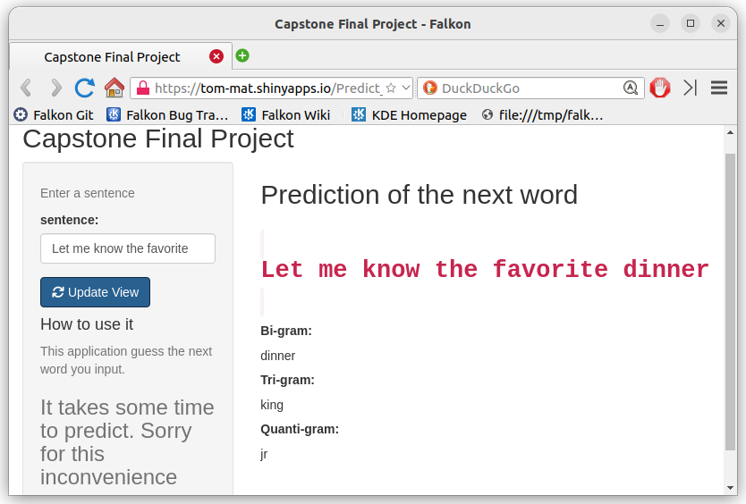

```{r setup, include=FALSE}
knitr::opts_chunk$set(echo = FALSE)

```

## Introduction

This is a capstone final project of "Data Science Capstone" course of Johns Hopkins Univ. The shiny application is built with quanteda package. The application predicts the next word with the last word, the last two words or the last three words. At the beginning of this project, I built the dataset of words of bigram, trigram and quantigram. When you search a sentence with this application, the application will find the word in the each datasets, and then show the most frequent word. 

You can see my Shiny application as follows:  
https://tom-mat.shinyapps.io/Predict_Next_Words/


## Preparation of Ngram dataset

At the begining of this project, I built the several Ngram dataset as follows:  
  
- With three raw data such as US blogs, US news and US twitter) , I sampled 5000 sentences from each raw data, and combined them into a single dataset.was sampled individuallyand combined into a single dataset.  
- Next, the single dataset is tokenized with "tokens()" of the quanteda package. At the same time, I cleaned these tokens with the functions such as "remove_punct", "stopwords" or "wordstem".   
- Finally, I built n-gram files with using token_ngrams function.

## Algorithm for the Prediction

The prediction model operates by running through the n-gram models:  
  
- First, read each of ngram files.  
- Second, the sentence that user input is tokenized and cleaned with quanteda function. The several last words of tokens are built with the name of "sentence_last", "sentence_last2", and "sentence_last3".  
- Third, the system finds the mutched ngram tokens with several last sentence.  
- Fourth, the system output the most frequent words from each ngram files and save it into variable "only_top".  
- Finally, the shiny app show the result of each ngram. 

## Shiny App 

This is a screenshot of my shiny application.  

